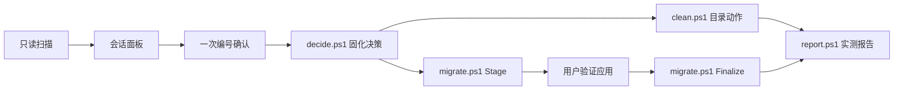

# C Drive Savior / C盘拯救者

你只需要对 Agent 说一句“C 盘快满了”或“帮我清理电脑空间”，它就会分析 Windows 系统盘，生成一份本地可打开的可视化报告，并把需要你决定的项目一次列清楚。

报告会说明 C 盘空间被什么占用：哪些是系统和软件缓存，哪些是临时文件，哪些是下载、聊天、浏览器或开发工具数据，哪些目录最大，哪些适合优先处理。每一项都会给出具体路径、实测大小、风险等级、处理建议，以及删除或迁移后可能带来的影响。

它不是普通的“无脑清理工具”。

很多清理软件只会告诉你“发现 12GB 垃圾文件”，却不解释这些文件是什么，也不说明删除后是否会影响登录状态、软件修复、聊天记录、项目文件或系统更新。C Drive Savior 的核心是让 Agent 先把空间占用讲明白，再通过受限制、可确认、可追溯的脚本完成操作。

```text
只读扫描 -> 一轮确认 -> 会话绑定清理 -> 分阶段迁移 -> 实测报告
```

## 这次更新带来了什么

- **更清楚的空间面板**：PowerShell 和 Python 扫描器使用同一份分类规则与报告界面，按同级目录从大到小展示，并说明可见目录与磁盘已用空间的差额、拒绝访问和未完成扫描。
- **更可靠的一次确认**：可重建缓存、需确认数据、禁止手删目录、可迁移项目，以及需要用户判断是否仍在使用的软件目录一次编号列出，不再逐轮追问。
- **更严格的清理边界**：清理器只接受本次扫描发现、用户明确批准且存在于受限目录中的 `action_id`，不会把任意路径拼成删除命令。
- **更稳妥的 D 盘迁移**：先 Stage 复制并核对文件清单、字节与 ACL；用户实际打开软件验证后，Finalize 会重新检查源目录并核对文件哈希，确认一致才允许删除源目录或建立 junction。
- **更可信的结果报告**：清理前后使用同一个 Session ID，分别显示 C 盘净释放空间、各动作可归因空间、失败或部分完成项目和撤销信息。
- **更诚实的异常处理**：遇到锁定文件、重解析点、权限拒绝或系统组件异常时会明确显示具体路径和状态，不把部分结果包装成“清理成功”。

## 它解决什么

- C 盘突然爆满，不知道空间被什么占用
- 临时目录、浏览器和开发缓存持续增长
- 下载、聊天文件、游戏库或项目数据需要迁到 D 盘
- 清理软件给出一个总数，但不解释修复、登录、聊天记录或项目风险
- 文件夹大小总和与磁盘已用空间对不上

分析结果按四类展示：

- `GREEN / 可放心清理`：已知、可重建的临时文件和缓存。关闭占用程序并确认后，可以交给受限清理器处理。
- `YELLOW / 需要确认`：用户文件、安装修复缓存、聊天内容、离线数据或重建成本较高的内容。Agent 会解释后果，但不会自动删除。
- `RED / 不建议动`：系统核心、程序安装目录、组件存储和活动数据库。只解释占用原因或引导使用官方工具，不提供危险的手删操作。
- `MOVE / 建议迁移`：适合通过应用设置、Windows 已知文件夹重定向或验证迁移转移到 D 盘的数据。

## 安全边界

1. 默认只读，扫描完成前不执行破坏性动作。
2. 所有清理和迁移动作都需要用户主动确认；用户资料、YELLOW 和 RED 项目不会进入一键清理。
3. 决策写入不可变会话；后续清理、迁移和报告必须携带同一个 Session ID。
4. 扫描行的路径哈希 `id` 用于迁移，目录 `action_id` 用于受限 GREEN 清理，避免把“看起来像缓存”直接变成删除命令。
5. 清理器只接受共享目录中的动作，拒绝盘符根目录、越界路径、重解析点、受保护路径和未批准项目。
6. 迁移分为 Stage 与 Finalize。Stage 复制并校验但保留源；用户验证应用后，Finalize 才能删除源或建立 junction。
7. 报告区分磁盘净变化与动作可归因释放量，并显示失败、部分完成、拒绝访问和撤销信息。

## 工作方式



PowerShell 与 Python 扫描器输出同一个 v2 契约，使用同一份分类目录和同一套 HTML 资源。扫描采用单次流式遍历，跳过 junction/symlink，并在 NTFS 文件身份可用时去重硬链接。隐藏系统占用单独呈现，避免与可见目录重复扣减。

## 快速开始

安装到 Codex：

```powershell
$skills = "$env:USERPROFILE\.codex\skills"
New-Item -ItemType Directory -Force $skills | Out-Null
git clone https://github.com/Choysang/C-Drive-Savior.git "$skills\c-drive-savior"
```

安装到 Claude Code：

```powershell
$skills = "$env:USERPROFILE\.claude\skills"
New-Item -ItemType Directory -Force $skills | Out-Null
git clone https://github.com/Choysang/C-Drive-Savior.git "$skills\c-drive-savior"
```

重启 Agent，然后说：`C盘满了`、`看看C盘`、`帮我安全释放空间`、`哪些文件可以移到D盘`。

只运行只读面板：

```powershell
powershell -NoProfile -ExecutionPolicy Bypass -File .\scripts\scan.ps1 -ThresholdGB 1 -OpenReport
```

命令会打印 Session ID、`scan.json` 和 `panel.html` 的位置。完整的确认、执行和报告命令见 [SKILL.md](SKILL.md)。

## 依赖

运行时：

- Windows 10/11 与 NTFS 系统盘
- Windows PowerShell 5.1 或 PowerShell 7；主流程不需要第三方 PowerShell 模块
- Python 仅用于可选扫描器，主流程不要求安装
- HTML 面板为静态本地文件，不启动删除接口或本地 Web 服务

开发与 CI：

- Pester 5.6.1、Python `unittest`、`jsonschema` 与 PyYAML
- Windows CI 覆盖 Python 3.9/3.13、PowerShell 7 和 Windows PowerShell 5.1

## 仓库结构

```text
assets/       共享静态报告模板与脚本
config/       风险分类和 27 类受限清理动作
modules/      会话、路径、目录解析和动作日志核心
native/       NTFS 文件身份与分配大小读取
scripts/      scan / decide / clean / migrate / report 与 Python 扫描器
schemas/      session / scan / decisions / action v2 JSON Schema
references/   风险判断、迁移手册、历史故障和证据来源
tests/        PowerShell 5.1/7、Python、契约和跨扫描器测试
benchmarks/   固定夹具与真实磁盘的可复现基准方法
evals/        Skill 行为与安全门禁评测
```

## 性能声明

项目不预设哪个扫描器更快。基准必须在同一机器、同一目录树上顺序运行旧版与新版，保存原始耗时、峰值内存、文件数、拒绝路径和完成状态，再谈结论。方法见 [benchmarks/README.md](benchmarks/README.md)。安全与正确性改进不会伪装成速度提升。

## 真实教训

- 清空 `Package Cache` 后，软件修复功能可能找不到原安装包。
- 组件存储损坏时运行 DISM 清理会继续失败，SFC 也可能无法执行。
- 双引号中的 `C:\$WINDOWS.~BT` 会触发 PowerShell 变量展开，指向错误路径。
- 只比文件数和总字节不能证明迁移内容一致；Finalize 还需要逐文件哈希和元数据复核。
- `SilentlyContinue`、跨会话日志和短路径/重解析点都可能制造“看似成功”的假象。

完整根因与处理规则见 [references/pitfalls.md](references/pitfalls.md)。

## 致谢与许可

决策清单、分段空间条和“现状 -> 诊断 -> 处方 -> 操作 -> 预防”的报告结构受到 [storage-analyzer](https://github.com/KKKKhazix/khazix-skills/tree/main/storage-analyzer) 启发。本项目将其改造成 Windows 专用、会话绑定、默认无破坏性网页控制的工作流。官方与社区来源见 [references/research-sources.md](references/research-sources.md)。

MIT License
