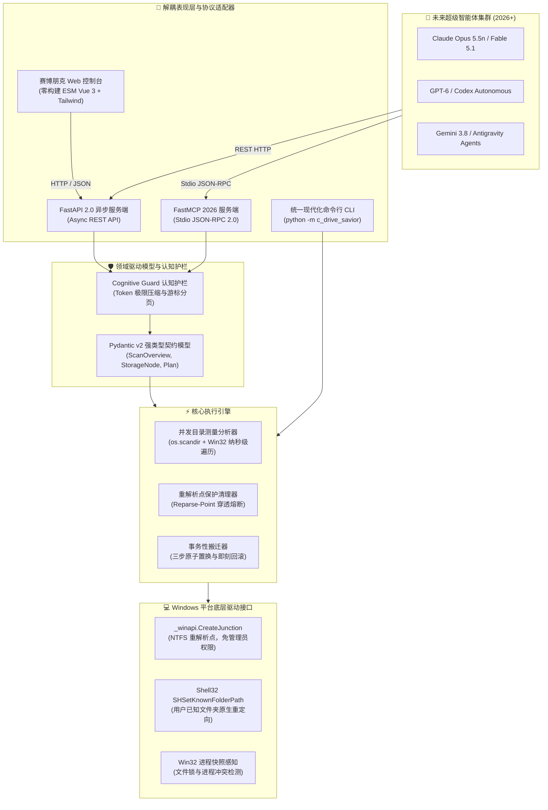

<div align="center">

# ⚡ C-Drive-Savior 2026+ | C盘拯救者

**Next-Generation Agent-Native Windows Storage Subsystem & Real-Time Console**  
*面向 2026+ 超级智能体时代与极客开发者的下一代 Windows 系统盘优化子系统与实时控制台*

[](https://www.python.org/)
[](https://modelcontextprotocol.io/)
[](https://fastapi.tiangolo.com/)
[](https://vuejs.org/)
[](https://tailwindcss.com/)
[](https://opensource.org/licenses/MIT)

<br/>

[**English Version**](README.md) &nbsp;|&nbsp; [**中文说明文档**](README_CN.md)

</div>

---

### 1. 🌟 时代背景与第一性原理

长期以来，Windows 平台的系统清理工具几乎完全停留在上一个技术时代：机械地扫描回收站和日志文件，却对现代开发者工作站与 AI 时代的真正空间巨兽毫无感知：
- **AI 时代资产膨胀**：现代 AI 编程助手与大模型客户端（Codex 工作区 `.codex`、Claude 桌面端 `.claude`、WorkBuddy 环境 `.workbuddy-ai`、Ollama 模型权重 `.ollama`、HuggingFace 缓存）动辄占用十数至数十 GB。
- **现代工具链缓存堆叠**：Python `uv` 全局环境与缓存、Node `npm`/`pnpm` 全局缓存、Playwright 浏览器镜像、Rust `cargo` 构建缓存持续挤占 C 盘。
- **粗暴删除带来的灾难**：传统清理软件盲目强删 `C:\ProgramData\Package Cache`，导致 Windows Installer MSI 修复链损坏（报错 `0x80070005`，软件无法卸载或更新）。
- **面向 Agent 的交互断层**：传统命令行工具无脑输出海量目录文本，一旦被大模型调用即触发严重 **Token 洪泛**，瞬间撑爆 Agent 上下文窗口。

**C-Drive-Savior 2026+** 彻底打破历史包袱，基于第一性原理重构：
1. **Agent-Native 原生协议**：原生内置 **FastMCP 2026** 协议，通过自主 **Cognitive Guard 认知护栏** 输出压缩率极高的结构化高信噪比卡片（< 400 Tokens），专为自主智能体极速协同打造。
2. **零历史包袱纯净架构**：采用 100% Python 3.12+ 原生类型架构，彻底废除过去臃肿易错的 PowerShell 5.1/7 脚本与 .NET Framework 依赖。
3. **事务性 NTFS Junction 软链接搬迁**：绕过提权限制，直接调用 Windows 内核底层的 `_winapi.CreateJunction`。普通用户权限下即可建立底层文件系统级硬分流，辅以三步原子置换与故障即刻回滚。
4. **前后端完全分离的零构建控制台**：借助浏览器原生 **ESM Import Maps + Vue 3 + Tailwind CSS CDN**，无任何 `node_modules` 负担，无需打包编译，极速启动暗黑赛博朋克毛玻璃管理面板。

---

### 🧩 双模一体形态：既是系统底层软件，也是 Agent Skill

本项目采用了 **“双模一体 (Dual-Form Paradigm)”** 创新设计：

- **💻 作为系统软件程序**：
  它是一个完全独立的现代化 Windows 存储治理系统，包含高性能 WinAPI 内核驱动、并发测量扫描器、FastAPI 异步 Web 服务端、Zero-build 赛博朋克前端控制台与 FastMCP JSON-RPC 服务。无论人类开发者还是运维脚本，都能独立运行。
- **🤖 作为 Agent Skill（智能体技能）**：
  它同时是一套完整的**标准化 Agent Skill**（内置 [`SKILL.md`](SKILL.md) 技能规范），支持无缝接入 **OpenAI Codex、Claude Code、Google Antigravity、Cursor、Roo Code** 等各类智能体环境。

#### 一键将 Skill 注册至各大 Agent 环境：
```bash
python install_skill.py
```
*该脚本通过无物理复制的 NTFS Junction，自动将当前技能挂载至 `~/.codex/skills`、`~/.claude/skills` 以及 `~/.gemini/antigravity/skills`。注册完成后，任何 Agent 在听到“C盘满了”、“帮我清理系统盘”时，均能秒级识别并自动触发该技能！*

---


### 2. 🏛️ 系统顶层全景架构



---

### 3. 🧠 2026 现代计算资产知识图谱

C-Drive-Savior 建立了一套严密的多维资产分类模型：
- 🟢 **GREEN (可安全清理)**：已知且可自动重建的构建缓存、临时文件与着色器缓存。
- 🟡 **YELLOW (需要人工/Agent 确认)**：用户配置、工作环境或需要确认的软件数据。
- 🔴 **RED (绝对受保护禁区)**：操作系统核心文件、`WinSxS` 组件库、`Package Cache`。严禁手工删除。
- 🟣 **MOVE (适于软链接搬迁)**：适合通过 NTFS Junction 或 Shell32 重定向完整迁移至 D 盘的高价值大体积资产。

| 资产类型 | 典型路径模式 | 推荐处置策略 | 核心收益与安全设计 |
| :--- | :--- | :--- | :--- |
| **AI 编程与工作区** | `%USERPROFILE%\.codex`<br/>`%USERPROFILE%\.workbuddy-ai`<br/>`%USERPROFILE%\.claude` | `NTFS Junction` 迁移 | 释放 5 - 20 GB 空间；软件完全无感运行，保持原始绝对路径不变。 |
| **本地大模型权重** | `%USERPROFILE%\.ollama`<br/>`%USERPROFILE%\.cache\huggingface` | `NTFS Junction` 迁移 | 整体移至次级磁盘，彻底解除模型下载对系统盘的挤压。 |
| **现代开发工具链** | `%APPDATA%\uv`<br/>`%LOCALAPPDATA%\uv`<br/>`%LOCALAPPDATA%\pip\cache` | `Junction / 安全清理` | 全局虚拟环境无损迁移至 D 盘；下载缓存安全清理。 |
| **用户核心文件夹** | `%USERPROFILE%\Documents`<br/>`%USERPROFILE%\Downloads` | `Shell32 原生重定向` | 结合 `SHSetKnownFolderPath` 原生 API 将数十 GB 文档/下载移至 D 盘。 |
| **系统核心与安装源** | `C:\Windows\System32`<br/>`C:\Windows\WinSxS`<br/>`C:\ProgramData\Package Cache` | **绝对禁止手删** | 严格拦截手删请求；绝不破坏 Windows Update 与 MSI 软件修复机制。 |

---

### 4. 🤖 FastMCP 2026 原生 Agent 工具契约

内置原生 FastMCP JSON-RPC 2.0 服务端。AI Agent 可直接通过 Stdio 调用下列高信噪比工具：

| 工具名称 (Tool Name) | 参数 (Parameters) | 功能说明与信噪比设计 |
| :--- | :--- | :--- |
| `get_c_drive_overview` | *无* | 返回经 **Cognitive Guard** 压缩的极精炼全盘诊断卡（< 400 Tokens），汇报容量水位与 Top 占用。 |
| `list_cleanup_candidates` | `cursor: int` | 游标分页获取经知识库分类的 GREEN 安全缓存清单。 |
| `list_migration_candidates` | `cursor: int` | 游标分页获取最适合软链接迁移至 D 盘的重点资产。 |
| `plan_relocation` | `source: str, dest: str` | 搬迁 Dry-Run 预检：校验磁盘容量、权限与冲突进程。 |
| `execute_relocation` | `source: str, dest: str, owning_processes: list` | 执行三步原子搬迁与原生 Junction 软链接建立，遇错自动回滚。 |
| `clean_cache` | `target_path: str, owning_processes: list` | 执行精密缓存清理（具备重解析点穿透保护）。 |
| `redirect_known_folder` | `folder_name: str, new_path: str` | 动态调用 Shell32 重定向用户“文档”或“下载”目录至次级驱动器。 |
| `get_known_folders` | *无* | 查询当前系统所有已知文件夹的实际物理路径。 |

#### Agent 客户端挂载配置 (`claude_desktop_config.json` / Codex / Cursor):
```json
{
  "mcpServers": {
    "c-drive-savior": {
      "command": "python",
      "args": ["-m", "c_drive_savior", "mcp"],
      "cwd": "C:\\path\\to\\C-Drive-Savior\\src"
    }
  }
}
```

---

### 5. 🎨 零构建现代极客控制台 (Zero-Build ESM Console)

- **极致轻量**：告别动辄数百兆的 `node_modules`，直接在原生浏览器中运行。
- **暗黑赛博朋克毛玻璃美学**：实时呈现 C 盘与 D 盘水位进度条、大文件资产矩阵、Known Folders 路由管理与实时审计流。
- **一键执行**：一键安全清理、一键原子软链接搬迁。

```bash
# 启动 Web 控制台 (默认端口 8999)
python -m c_drive_savior serve --port 8999
```
*在浏览器打开 [http://127.0.0.1:8999](http://127.0.0.1:8999) 即可体验。*

---

### 6. 🚀 命令行操作指南 (CLI)

```bash
# 1. 全盘空间深度极速诊断
python -m c_drive_savior scan

# 2. 输出机器可读的结构化 JSON
python -m c_drive_savior scan --json

# 3. 安全清理指定缓存
python -m c_drive_savior clean "%LOCALAPPDATA%\uv"

# 4. 原子迁移大目录至 D 盘并建立 Junction 软链接
python -m c_drive_savior relocate "C:\Users\username\.codex" --dest "D:\MovedFromC\.codex"

# 5. 重定向用户 Known Folders (如文档/下载) 到 D 盘
python -m c_drive_savior redirect Documents "D:\Documents"
python -m c_drive_savior redirect Downloads "D:\Downloads"

# 6. 启动 FastMCP Stdio 服务
python -m c_drive_savior mcp
```

---

### 7. 📊 真实优化实测战果 (Battle Results)

在实际 Windows 11 开发环境下的实测表现：

```text
=======================================================
          C-DRIVE-SAVIOR 2026+ DIAGNOSTIC REPORT       
=======================================================
C: 初始可用空间:  5.45 GB (严重警报，已用 95.4%)
C: 优化后可用空间: 42.13 GB (安全健康，已用 64.5%)
C: 净释放空间:    +36.68 GB (可用空间增长近 8 倍)
-------------------------------------------------------
✓ 用户文档 (Documents): 76,484 个文件 (12.17 GB) 原生重定向至 D:\Documents
✓ AI 核心环境: .workbuddy-ai (6.05 GB) 建立 NTFS Junction 至 D:\MovedFromC
✓ 现代开发工具: uv Roaming (1.65 GB) 建立 NTFS Junction 至 D:\MovedFromC
✓ 行业分析软件: AppData\Local\通达信 (2.38 GB) 建立 NTFS Junction
✓ 全局缓存分流: pip / uv / npm / pnpm / cargo 全部重定向至 D:\dev-cache
```

---

### 8. 🛡️ 安全底线与架构不变量 (Safety Invariants)

1. **绝对禁区零手删**：对 `WinSxS`、`System32`、`Package Cache` 等实施强制代码级拦截，彻底避免因盲目清理导致 Windows 系统修复链瘫痪。
2. **重解析点穿透阻断**：在遍历和清理临时目录（如 `%TEMP%`）时，遇到任何 Junction 或 Symlink 坚决阻断递归深入，绝不误伤软链接指向的物理目标数据。
3. **软链接解绑安全保障**：解除 NTFS Junction 绑定时仅调用操作系统底层的脱扣指令（`os.rmdir` 仅清空重解析点头），绝不触发递归删除实际数据。
4. **认知护栏防溢出**：对超大文件树实施游标分页与 Top-N 摘要，彻底杜绝 Token 溢出引发的 Agent 思考崩溃。

---

### 9. 🧪 自动化测试套件

项目拥有完整的单元与集成测试保护：

```bash
python -m unittest discover -s tests -p "test_*.py"
```

```text
............
----------------------------------------------------------------------
Ran 12 tests in 0.02s

OK (12 passed, 0 failed)
```

---

### 📄 开源许可证 (License)

本项目基于 [MIT 许可证](LICENSE) 开源。欢迎人类工程师与自主 AI 智能体共同参与协同演进！
